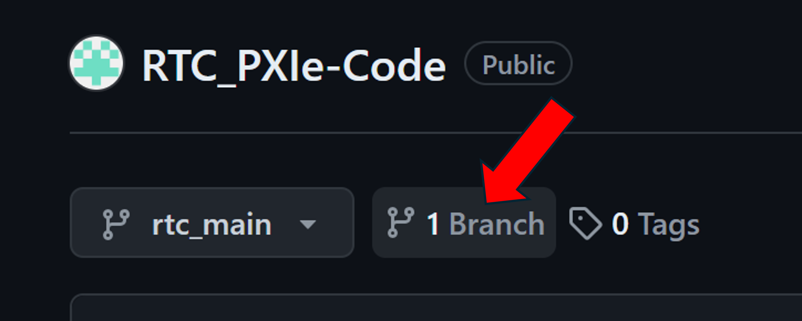
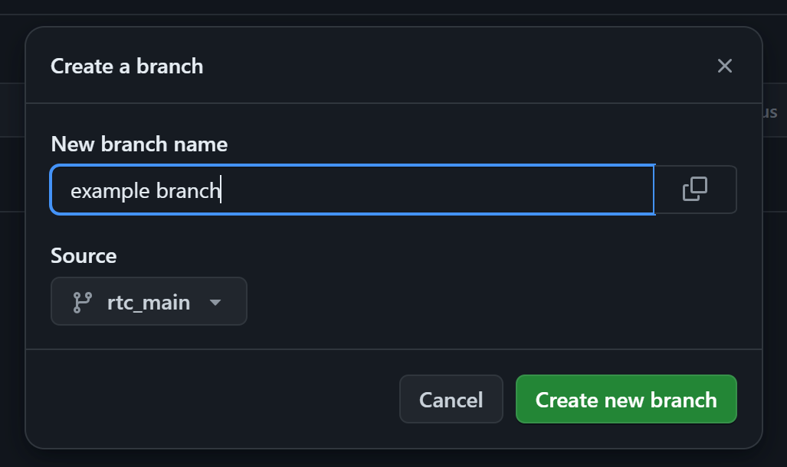
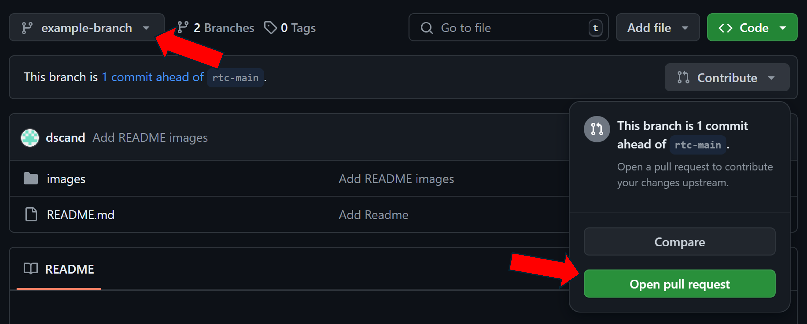

# Pull Requests
Commits should not be done directly to `rtc-main`, and instead through pull requests.\

## Create a new branch

Branch will be created as `example-branch`

### Branch Naming
A descriptive name should be used based on what is being done in the branch
>\- Development branches should start with `dev/`\
>\- Release branches should start with `release/`\
>\- All other branches should start with `experimental/`

## Committing Code
Use `git checkout [branch name]` to shift to created branch.\
A descriptive commit message should be used based on what was changed with the commit.

Workflow
1. Modify code
2. Stage changes
3. Commit staged changes
4. Push commits

### Squashing Commits
Branches should be squashed before merging to main, this means only one commit is on the branch for merge.\
`git reset --soft $(git merge-base HEAD origin/rtc-main)`\
`git commit -m "[commit message]"`\
`git push -f`

### Merge Conflicts
Merge conflicts need to be resolved before pull request can be merged.\
`git pull origin rtc-main`\
*Resolve conflicts*\
`git commit`\
`git push origin HEAD`

## Creating Pull Request

The title of the pull request should closely match the title of the created branch.\
The description should list a description of all changes done in this pull request.
